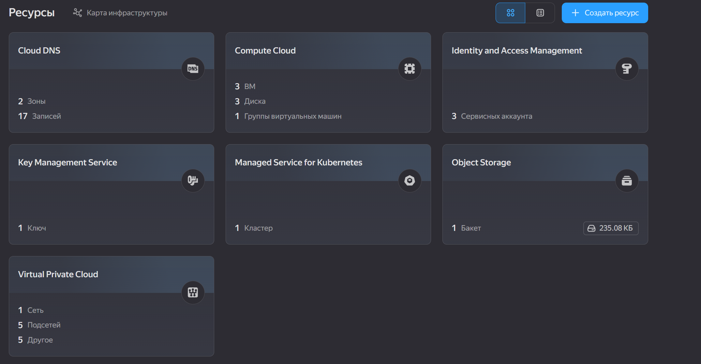

# Terraform Bootstrap

[](https://www.terraform.io/)
[](https://cloud.yandex.ru/)

Bootstrap-модуль Terraform для дипломного практикума в Yandex.Cloud. Создаёт сервисный аккаунт, ключи и S3-бакет для хранения state основной инфраструктуры.

**Автор:** Дудников Даниил
**Группа:** FOPS-41
**Период работы:** 3 октября 2026 — 26 октября 2026

---

##  Что создаётся

| Ресурс | Описание |
|--------|----------|
| **SA** | `diploma-terraform-sa` — сервисный аккаунт для Terraform |
| **Роли** | 8 ролей на folder |
| **Ключ SA** | Авторизованный ключ для Terraform |
| **S3 bucket** | `diploma-tfstate-dudnikov-7efeef` — для хранения state |
| **S3 ключ** | Для доступа к bucket |

### Роли сервисного аккаунта

- `compute.admin` — управление ВМ
- `vpc.admin` — управление сетями
- `k8s.admin` — управление Kubernetes
- `storage.admin` — управление S3
- `iam.serviceAccounts.user` — использование SA
- `logging.writer` — запись логов
- `iam.admin` — управление IAM
- `resource-manager.admin` — управление ролями

### S3 bucket

- **Версионирование:** включено
- **Lifecycle:** удаление старых версий через 30 дней
- **Лимит:** 1 GB
- **Публичный доступ:** запрещён

---

##  Скриншоты

### S3 bucket создан


*S3 bucket `diploma-tfstate-dudnikov-7efeef` для хранения Terraform state.*

### Terraform outputs


*Outputs после `terraform apply`: имя bucket, ID и т.д.*

### Terraform state


*Список ресурсов в Terraform state.*

### Обзор ресурсов в консоли YC



*Обзор созданных ресурсов в консоли Yandex Cloud.*

---

##  Структура репозитория

```
.
├── main.tf                   # Создание S3 bucket
├── versions.tf               # Версии Terraform и провайдера
├── providers.tf              # Настройка провайдера Yandex
├── variables.tf              # Переменные
├── outputs.tf                # Outputs
├── docs/
│   └── screenshots/          # Скриншоты
└── README.md                 # Этот файл
```

---

##  Применение

```bash
terraform init
terraform plan
terraform apply
```

---

##  Ссылки

- [Основной проект diploma-app](https://github.com/DudnikovDaniil/diploma-app)
- [terraform-infrastructure](https://github.com/DudnikovDaniil/terraform-infrastructure)

---	


##  Лицензия

Учебный проект. Свободное использование в образовательных целях.

© 2026, Дудников Даниил
